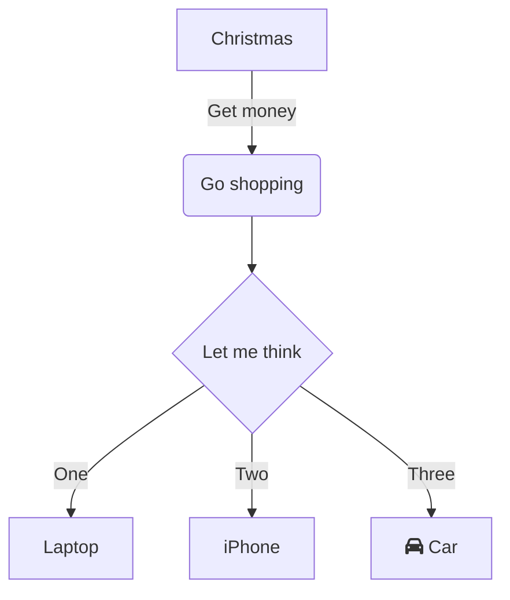

+++
title = "Hello and Disclaimer"
date = 2025-08-31T14:00:00Z
author = "sysadmin"
toc_depth = 3
+++

This site hosts systems journal logs and technical documentation.

Please note: content may contain inaccuracies—open an issue or pull request at [github.com/colosieve/blog](https://github.com/colosieve/blog) if something needs correction.

## Shamelessly Hijacking This Post for Style Testing

Bump up this number for testing: 103.



## Code Style Demo


Here's some inline code: `const greeting = "Hello, World!";`

And a code block example:

```javascript
// Function to calculate fibonacci sequence
function fibonacci(n) {
    if (n <= 1) return n;
    
    let prev = 0, curr = 1;
    for (let i = 2; i <= n; i++) {
        [prev, curr] = [curr, prev + curr];
    }
    return curr;
}

console.log(fibonacci(10)); // Output: 55
```

And the same code with line numbers:

```javascript {linenos=true}
// Function to calculate fibonacci sequence
function fibonacci(n) {
    if (n <= 1) return n;
    
    let prev = 0, curr = 1;
    for (let i = 2; i <= n; i++) {
        [prev, curr] = [curr, prev + curr];
    }
    return curr;
}

console.log(fibonacci(10)); // Output: 55
```

Another example in Python:

```python
def merge_sort(arr):
    """Recursive merge sort implementation"""
    if len(arr) <= 1:
        return arr
    
    mid = len(arr) // 2
    left = merge_sort(arr[:mid])
    right = merge_sort(arr[mid:])
    
    return merge(left, right)
```

And some shell commands:

```bash
# Deploy to production
hugo --minify
rsync -avz public/ server:/var/www/
echo "Deployment complete"
```
